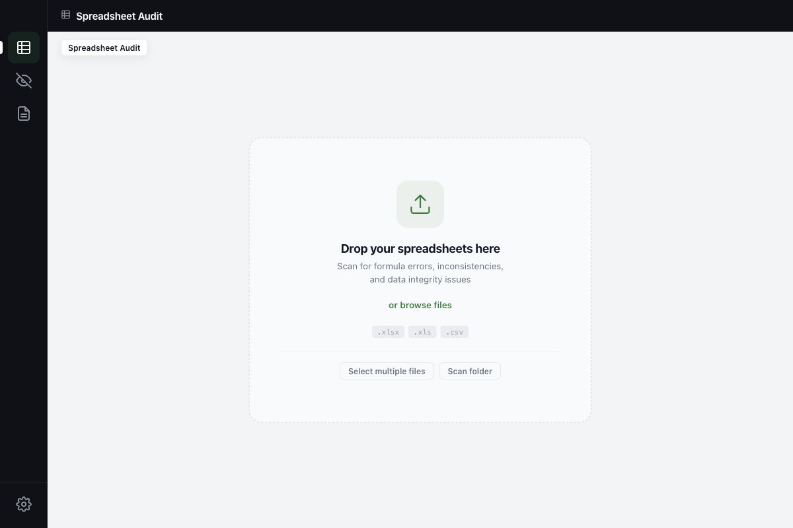
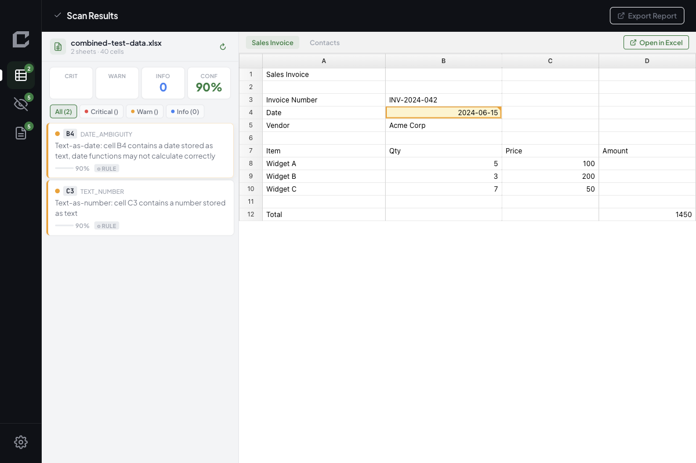
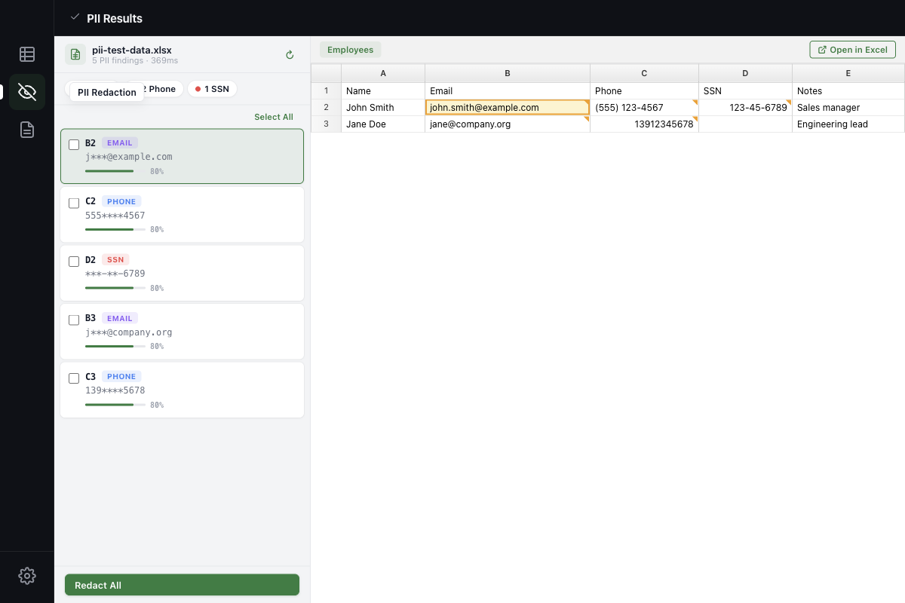
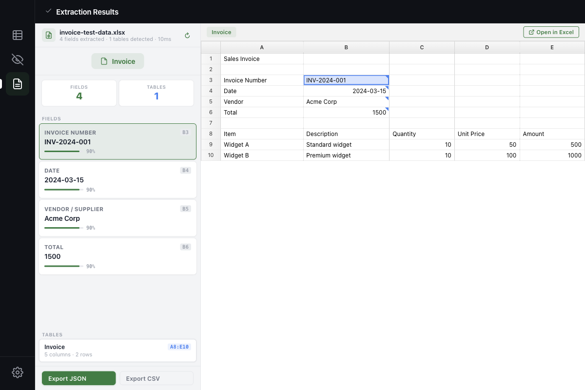

<p align="center">
  
</p>

<h1 align="center">CellSentry <sup>BETA</sup></h1>

<p align="center">
  <strong>An experimental local AI toolbox for spreadsheet analysis</strong>
  <br>
  Audit formulas, detect PII, and extract structured data — your data never leaves your machine.
</p>

<p align="center">
  <a href="https://github.com/almax000/cellsentry/releases/latest"></a>
  <a href="LICENSE"></a>
  <a href="https://huggingface.co/almax000/cellsentry-model"></a>
  <a href="https://github.com/almax000/cellsentry/releases"></a>
</p>

---

> **Note**: CellSentry is an experimental research project in active development. The AI model is a fine-tuned 1.5B parameter SLM — expect rough edges. Feedback and contributions welcome.

<p align="center">
  
</p>
<p align="center">
  
</p>
<p align="center">
  
</p>
<p align="center">
  
</p>

## What is CellSentry?

CellSentry is a desktop app that explores using local small language models (SLMs) for spreadsheet intelligence tasks. It combines a deterministic rule engine with an optional 1.5B LLM for three analysis modes:

### Formula Audit

- **23 audit rules** in 7 categories: consistency, references, logic, hardcoding, structure, style, complexity
- **Batch scanning** — drag & drop multiple files or folders
- **Confidence scoring** — each issue rated High / Medium / Low
- **AI verification** — optional local LLM confirms or dismisses findings (graceful degradation when unavailable)
- **Export reports** — HTML, PDF, or marked Excel files

### PII Detection

- **12 regex patterns** across 2 locales (US, CN)
- Detects: SSN, phone numbers, email, national IDs, credit cards, IBAN, passport numbers
- **Validators**: Luhn algorithm (credit cards), CN ID checksum
- **Masking preview** — see redacted values before exporting
- Cell-level highlighting with confidence scores

### Data Extraction

- **5 document types**: invoice, receipt, purchase order, expense report, payroll
- **Bilingual templates** — English and Chinese header matching
- Field extraction: invoice number, date, vendor, totals, line items
- **Table detection** — automatic header/row identification
- **Export**: JSON or CSV structured output

## Download

> **Beta release** — expect bugs. Please [report issues](https://github.com/almax000/cellsentry/issues) you encounter.

| Platform | Download |
|----------|----------|
| macOS | [CellSentry.dmg](https://github.com/almax000/cellsentry/releases/latest) |
| Windows | [CellSentry-Setup.exe](https://github.com/almax000/cellsentry/releases/latest) |

## AI Model

CellSentry uses a fine-tuned local SLM for AI-enhanced analysis. The model:

- **[almax000/cellsentry-model](https://huggingface.co/almax000/cellsentry-model)** on HuggingFace (~940 MB, GGUF)
- Fine-tuned from [Qwen2.5-1.5B](https://huggingface.co/Qwen/Qwen2.5-1.5B) with LoRA
- Multi-task: formula audit verification, PII classification, data extraction
- Runs entirely on your machine (MLX on Mac, llama.cpp on Windows)
- Downloads automatically on first launch
- **Gracefully degrades** — all three features work without the model

Manual download:

```bash
huggingface-cli download almax000/cellsentry-model cellsentry-1.5b-v3-q4km.gguf --local-dir ./models
```

### Current Limitations

- Model trained on English and Chinese data only
- PII patterns cover US and CN formats (no EU/JP/KR patterns yet)
- Extraction templates for 5 document types
- 1024 token context — large spreadsheets need chunking

## Build from Source

```bash
git clone https://github.com/almax000/cellsentry.git
cd cellsentry/app
npm install
npm run dev
```

**Requirements:** Node.js 20+, npm

### Build Installers

```bash
# macOS
cd app && npm run build:mac

# Windows
cd app && npm run build:win
```

### Run Tests

```bash
cd app && npm run typecheck     # Type checking
cd app && npx playwright test   # E2E tests (requires build first)
```

## Tech Stack

- [Electron](https://www.electronjs.org/) — cross-platform desktop framework
- [React](https://react.dev/) — UI components
- [TypeScript](https://www.typescriptlang.org/) — type-safe codebase
- [ExcelJS](https://github.com/exceljs/exceljs) — Excel file parsing
- [Qwen2.5-1.5B](https://huggingface.co/Qwen/Qwen2.5-1.5B) — base model for AI features
- [electron-vite](https://electron-vite.org/) — build tooling

## Project Structure

```
app/
├── electron/           # Main process
│   ├── engine/         # Rule engine (23 rules, 7 categories)
│   ├── pii/            # PII scanner (12 patterns, 2 locales)
│   ├── extraction/     # Document extractor (5 doc types)
│   ├── llm/            # Local LLM bridge (graceful degradation)
│   ├── model/          # Model downloader (HuggingFace)
│   ├── report/         # HTML report generator
│   ├── excel/          # Excel cell marker
│   └── main/           # Electron main + IPC
├── src/                # Renderer (React)
│   ├── components/     # UI components
│   ├── context/        # Scan state management
│   ├── i18n/           # Translations (EN/ZH)
│   └── hooks/          # React hooks
├── e2e/                # Playwright E2E tests
└── resources/          # App icons, DMG background
```

## Feedback & Community

- **Bug reports & feature requests** — [GitHub Issues](https://github.com/almax000/cellsentry/issues)
- **Questions & discussion** — [GitHub Discussions](https://github.com/almax000/cellsentry/discussions)
- **Updates** — [@almax000 on X](https://x.com/almax000)

## Contributing

See [CONTRIBUTING.md](CONTRIBUTING.md) for guidelines.

## License

[MIT](LICENSE)
